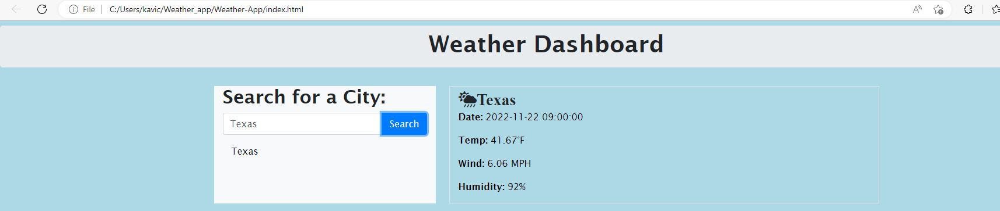

# Server-side APIs: Weather Dashboard

Third-party APIs allow developers to access their data and functionality by making requests with specific parameters to a URL. Developers are often tasked with retrieving data from another application's API and using it in the context of their own. Your challenge is to build a weather dashboard that will run in the browser and feature dynamically updated HTML and CSS.

WE use 5 day Weather Forescast (https://openweathermap.org/forecast5) to retrieve weather data for cities. 

## User Story

```
AS A traveler
I WANT to see the weather outlook for multiple cities
SO THAT I can plan a trip accordingly
```

## Acceptance Criteria

```
GIVEN a weather dashboard with form inputs
WHEN I search for a city
THEN I am presented with current and future conditions for that city and that city is added to the search history
WHEN I view current weather conditions for that city
THEN I am presented with the city name, the date, an icon representation of weather conditions, the temperature, the humidity, and the wind speed
WHEN I view future weather conditions for that city
THEN I am presented with a 5-day forecast that displays the date, an icon representation of weather conditions, the temperature, the wind speed, and the humidity
WHEN I click on a city in the search history
THEN I am again presented with current and future conditions for that city


```

The following image shows the web application's appearance and functionality:


Here are the steps we followed to complete the weather forecast challenge 

1. Register for new API key and activate it to use it in our challenge.

2. When a use search city name in input field and press search then the name of the city will store in local storage. 

3. The weather for the searched city will be fetch from weather API using the key and display the date, temperature, wind speed and humidity for the searched city.

4. In another container the next 5-day forecast will be display with date, temperature in F, wind speed and humidity. 

5. It keep changing based on the weather changes in third part API weather. 


Here is the screenshot the completed page - 





Here is the link for the deployed page - 